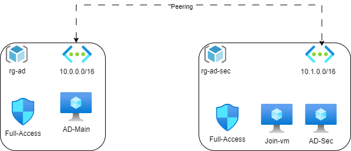

# Guia de Início para Configuração do Active Directory no Azure com Terraform


---

## Configurando o Ambiente do Active Directory no Azure com Terraform

Este script Terraform automatiza a implantação de um ambiente de Active Directory no Azure. O script provisiona grupos de recursos, redes virtuais, grupos de segurança, máquinas virtuais, entre outros. Siga as etapas abaixo para começar:

### Pré-requisitos

1. **Azure Subscription:**
   - Certifique-se de ter uma assinatura ativa no Azure.

2. **Terraform Instalado:**
   - Instale o Terraform em sua máquina local. Você pode encontrar o guia de instalação [aqui](https://learn.hashicorp.com/tutorials/terraform/install-cli).

### Etapas

1. **Clonar o Repositório:**
   - Clone este repositório em sua máquina local usando o seguinte comando:

     ```bash
     git clone [url_do_repositorio]
     ```

2. **Navegar para o Diretório do Projeto:**
   - Acesse o diretório do projeto:

     ```bash
     cd [diretorio_do_projeto]
     ```

3. **Editar Variáveis (Opcional):**
   - Abra o arquivo `variables.tf` e reveja/modifique variáveis como `admin_passwd`, `Domain_DNSName`, etc., de acordo com suas necessidades.

4. **Inicializar o Terraform:**
   - Execute o seguinte comando para inicializar seu ambiente Terraform:

     ```bash
     terraform init
     ```

5. **Revisar o Plano do Terraform:**
   - Execute o seguinte comando para revisar os recursos que o Terraform criará:

     ```bash
     terraform plan
     ```

6. **Aplicar a Configuração do Terraform:**
   - Aplique a configuração do Terraform para criar os recursos do Azure:

     ```bash
     terraform apply
     ```

   - Digite `yes` quando solicitado para confirmar a criação dos recursos.

7. **Aguardar a Conclusão:**
   - A implantação pode levar algum tempo. Uma vez concluída, o Terraform exibirá um resumo dos recursos criados.

8. **Acessar os Recursos:**
   - Consulte as saídas fornecidas pelo Terraform para obter informações sobre como acessar os recursos implantados (por exemplo, endereços IP públicos, URLs).

### Notas Adicionais

- **Scripts Personalizados:**
  - A implantação inclui scripts personalizados para a instalação do Active Directory (`ADDS.ps1`), promoção (`promote-ad.ps1`) e associação de domínio de VM (`join-ad.ps1`). Personalize esses scripts conforme necessário.

- **Desmontar Recursos:**
  - Quando terminar, você pode destruir os recursos criados usando:

    ```bash
    terraform destroy
    ```

    Confirme com `yes` quando solicitado.

### Considerações Importantes

- **Grupos de Segurança:**
  - Revise as configurações de grupos de segurança em `main.tf` para garantir que atendam aos seus requisitos de segurança.

- **Peering de Redes Virtuais:**
  - O script configura o peering de rede virtual entre as redes principal e secundária. Ajuste as configurações de peering conforme necessário.

- **Dependências:**
  - Os recursos têm dependências, e o Terraform garante que sejam criados na ordem correta. Tenha paciência durante a implantação.

---

Você configurou com sucesso um ambiente de Active Directory no Azure usando o Terraform. Para obter mais detalhes sobre a configuração de cada recurso, consulte os respectivos arquivos Terraform no projeto.
